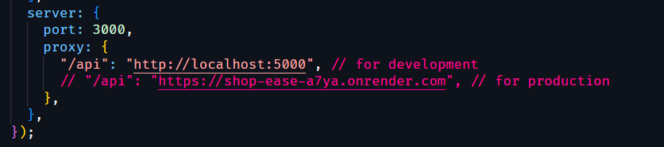
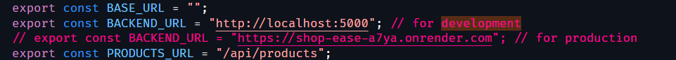

# Instruction for the development environment of the project

### 1. In the [`vite.config.js`](../client/vite.config.js) file do this

### 2. In the [`constants.js`](../client/src/constants.js) file do this

### 3. Follow all the comments there in the [`sample.env.txt`](../sample.env.txt) file to set up the env for development